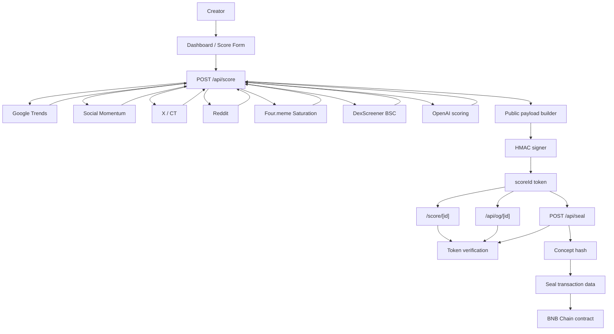

# 4racle

4racle is the trust layer for Four.meme launches on BNB Chain.

It helps creators decide whether to **Launch**, **Watch**, or **Do Not Launch Yet** before deploying a meme concept. The app combines 6 live signals, AI scoring, signed public evidence, and an optional on-chain seal so launch decisions are more transparent and harder to fake after the fact.

## Why this exists

Most meme launches start from screenshots, vibes, and post-hoc conviction.

That creates two problems:

1. creators lack a structured way to evaluate whether a concept is early, crowded, or already losing momentum
2. communities cannot easily verify what the market looked like before launch because scorecards and claims can be edited after the fact

4racle addresses both.

## What 4racle does

- Pulls **6 live signals**:
  - Google Trends
  - Social Momentum
  - X / CT Buzz
  - Reddit Pulse
  - Four.meme Saturation
  - DexScreener BSC
- Scores a concept from **0 to 100**
- Produces a public decision:
  - `Launch`
  - `Watch`
  - `Do Not Launch Yet`
- Explains the verdict with public reasons and evidence cards
- Signs the public result so the shared page, OG card, and seal request are verified from the same payload
- Lets creators optionally seal the verified score hash on BNB Chain

## Why it is different

4racle is not just an AI meme scorecard.

Its differentiator is the trust flow:

`6 live signals -> AI verdict -> signed public proof -> optional on-chain seal`

That means the result page is not only informative, but also verifiable.

## Product flow

1. A creator submits a meme concept on `/dashboard`
2. The server fetches 6 live signals in parallel
3. OpenAI generates a structured score breakdown and oracle verdict
4. The backend derives a public launch decision and public reasons
5. The public result payload is signed with HMAC
6. `/score/[id]`, `/api/og/[id]`, and `/api/seal` all verify the same signed payload before rendering or building transactions
7. The creator can optionally seal the verified score hash on BNB Chain

## Architecture

Full diagram: [docs/architecture-mermaid.md](/Users/apple/Downloads/4hackathon/4racle/docs/architecture-mermaid.md)



## Trust model

### Private input

The creator's full concept description is used during scoring, but it is **not** exposed in the public share payload.

### Public signed payload

The signed payload includes:

- concept name
- total score
- launch verdict
- public reasons
- dimension scores
- archetype
- oracle copy
- public signal summary
- coverage summary
- public evidence cards

The signed payload excludes:

- the full private concept description
- unsigned client-controlled result fields

### Verified consumers

These routes all verify the signed token before use:

- `/score/[id]`
- `/api/og/[id]`
- `/api/seal`

## Stack

- Next.js App Router
- React + TypeScript
- Vitest
- ethers
- OpenAI API
- BNB Chain

## Local development

Create `.env.local`:

```bash
OPENAI_API_KEY=
RAPIDAPI_KEY=
SHARE_TOKEN_SECRET=
NEXT_PUBLIC_CONTRACT_ADDRESS=
NEXT_PUBLIC_APP_URL=http://localhost:3000
```

Start the app:

```bash
npm install
npm run dev
```

Open [http://localhost:3000](http://localhost:3000).

## Verification

App-layer verification:

```bash
npm test
npm run lint
npm run build
```

Contract verification, if Foundry is available locally:

```bash
forge test
```

## Hackathon framing

For the Four.Meme AI Sprint, 4racle should be understood as:

**A trust-preserving launch intelligence tool for Four.meme creators**

Instead of asking:

`Does this meme feel good?`

4racle helps creators ask:

- Is this narrative early or already crowded?
- Is momentum forming or fading?
- Should this launch now, be watched, or be killed?

## Repository focus

The result page is the core product surface.

It is designed to act as:

- a creator decision tool
- a public proof page
- a shareable social asset
- a hackathon demo centerpiece
