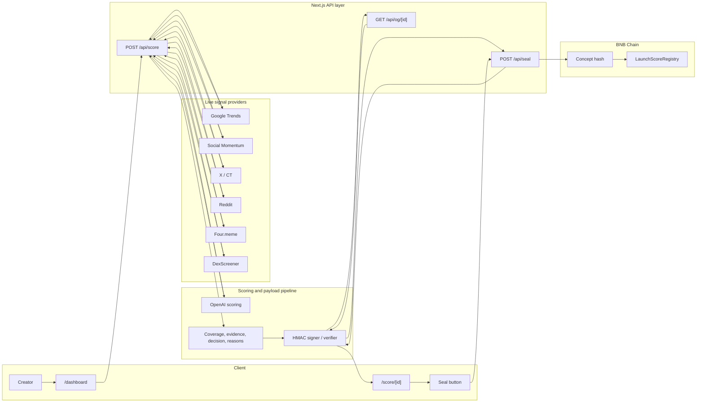

# 4racle Architecture

This diagram is intentionally submission-friendly. It maps to the current implementation without inventing infrastructure that does not exist.

## Reading the diagram

- `/api/score` is the private scoring route. It sees the full creator input.
- The public result is converted into a signed payload before it leaves the server.
- `/score/[id]`, `/api/og/[id]`, and `/api/seal` only work from the verified signed payload.
- The seal step hashes the verified public result and builds transaction data for the BNB Chain contract.
